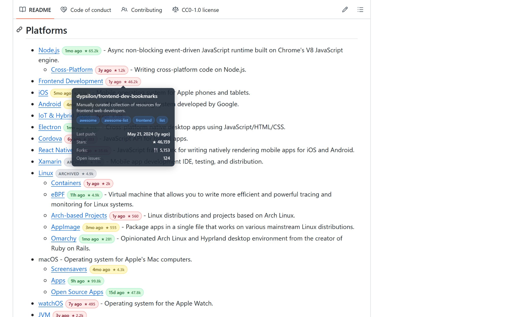

# 🔍 RepoLens

**Instantly see which GitHub repos are alive, stale, or dead — on any webpage.**

Ever browsed an awesome list with 500 repos and wondered which ones are still maintained? This extension scans every GitHub link on the page and injects a color-coded badge right next to it. No clicking. No new tabs. Just glance and know.

<!-- TODO: replace with actual screenshot -->
<!--  -->

## How it looks

Every GitHub repo link on any page gets a badge:

| Badge | Meaning |
|-------|---------|
| 🟢 `3d ago ★ 12k` | Active — pushed within 3 months |
| 🟡 `6mo ago ★ 890` | Aging — 3 to 12 months since last push |
| 🔴 `2y ago ★ 234` | Stale — over 1 year, likely unmaintained |
| ⚫ `archived ★ 1.2k` | Archived by owner |
| `404` | Repository deleted or renamed |

**Hover** any badge for a detailed tooltip: description, topics, stars, forks, open issues, language, license, and exact push date.

## Install

### Chrome Web Store

<!-- TODO: add link after publishing -->
<!-- [Install from Chrome Web Store](https://chrome.google.com/webstore/detail/...) -->

### Manual (Developer Mode)

```
git clone https://github.com/YOUR_USERNAME/repolens.git
```

1. Open `chrome://extensions/`
2. Enable **Developer mode** (top right)
3. Click **Load unpacked** → select the cloned folder
4. Done — visit any page with GitHub links

## Settings

Click the extension icon to configure:

**Display toggles** — turn on/off each piece of info individually:
- **Badge:** last update time, star count, archived label
- **Tooltip:** description, last push, created date, stars, forks, open issues, language, license, topics

**GitHub Token** — optional but recommended for large pages:

| | Without token | With token |
|---|---|---|
| Rate limit | 60 req/hour | 5,000 req/hour |
| Awesome list (200 repos) | ❌ Throttled | ✅ Instant |

To create a token: [GitHub Settings → Fine-grained tokens](https://github.com/settings/tokens?type=beta) → no special permissions needed (public repo metadata is default).

## Features

- **Works everywhere** — not just GitHub. Any webpage with `github.com` links (blogs, docs, Reddit, HN, etc.)
- **Smart caching** — 30-minute cache (memory + storage), won't re-fetch on page reload
- **Batch processing** — handles 500+ links without freezing the page
- **SPA support** — MutationObserver catches dynamically loaded content
- **Dark mode** — matches GitHub's dark theme automatically
- **Zero permissions abuse** — only calls `api.github.com`, no tracking, no analytics

## Use cases

- **Awesome lists** — the original motivation. See at a glance which tools are maintained
- **Documentation** — spot dead links in READMEs and wikis
- **Dependency audit** — check if your stack's repos are still active
- **Research** — quickly filter active projects from abandoned ones

## How it works

```
Page loads
  → Content script scans all <a href="github.com/..."> links
  → Extracts owner/repo, skips non-repo URLs (topics, explore, settings, etc.)
  → Batches API calls (30 concurrent) to GET /repos/{owner}/{repo}
  → Caches response (30 min TTL)
  → Injects badge + tooltip next to each link
  → MutationObserver watches for new links (infinite scroll, SPA navigation)
```

All data comes from a single API call per repo — no extra requests for tooltip info.

## Tech

- Chrome Extension Manifest V3
- Vanilla JS (no framework, no build step)
- GitHub REST API v3
- `chrome.storage.sync` for settings, `chrome.storage.local` for cache

## Project structure

```
repolens/
├── manifest.json     # Manifest V3 config
├── content.js        # Core logic: scan, fetch, badge, tooltip
├── styles.css        # All styles (light + dark mode)
├── popup.html        # Settings UI
├── popup.js          # Settings logic (token, toggles)
├── icons/            # Extension icons (16, 48, 128)
└── README.md
```

## Contributing

Issues and PRs welcome. Some ideas:

- [ ] Firefox support (WebExtension API is nearly identical)
- [ ] Export scan results as CSV/JSON
- [ ] Sort/filter badges on page (show stale first)
- [ ] Configurable freshness thresholds
- [ ] npm package health check (last publish date)

## License

MIT
